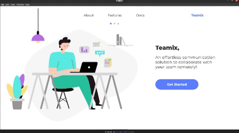

<p align="center">
<a href="https://microsoft.acehacker.com/engage2021/">
	
</a>
	<h2 align="center"> Teamix </h2>
	<h3 align="center"> An effortless communication solution to collaborate with your team remotely!<h3>
	<br />
<p align="center">
    <a href="https://docs.google.com/document/d/1ayBpxThUl-LSiEbMRk6PO29Vkzs6JzKYBtJACg6FwJU/edit?usp=sharing"><strong>Explore the docs »</strong></a>
    <br />
    <br />
    <a href="https://img.shields.io/badge/Video-Link%20to%20Video-blue?style=flat-square&logo=appveyor">View Demo</a>
    ·
    <a href="https://github.com/sharanya02/Teamix/issues">Report Bug</a>
    ·
    <a href="https://github.com/sharanya02/Teamix/issues">Request Feature</a>
	</p>
</p>

---

[](https://docs.google.com/document/d/1ayBpxThUl-LSiEbMRk6PO29Vkzs6JzKYBtJACg6FwJU/edit?usp=sharing) 
  [](https://www.figma.com/file/3SkFMId0IXsJMobMnReSO4/Engage?node-id=0%3A1)
[](https://drive.google.com/file/d/1RyYq6SSZkVtjWR0m3NgGykxNThPl4TbK/view?usp=sharing)


## 🔗 Important Links
 * [Video Demo](https://drive.google.com/file/d/1RyYq6SSZkVtjWR0m3NgGykxNThPl4TbK/view?usp=sharing)
 * [Documentation](https://docs.google.com/document/d/1ayBpxThUl-LSiEbMRk6PO29Vkzs6JzKYBtJACg6FwJU/edit?usp=sharing)
 * [UI](https://www.figma.com/file/3SkFMId0IXsJMobMnReSO4/Engage?node-id=0%3A1)
 * [Backend Repo (used for CICD pipeline)](https://github.com/sharanya02/Teamix-backend)
	
## 📝 Project Overview

Teamix is a fully functional clone of microsoft teams made using Agile development methodologies, as a part of the Microsoft Engage 2021 program.

## 🎯 Introduction
	
Having an excellent team space is key to being able to make creative decisions and communicate with one another. 
	Shared workspace software makes this much easier to achieve, especially if a particular team is based in a very large company, has many remote employees, or is made up of a significant number of team members. 
	</br> </br>
Keeping these in mind, introducing to you `Teamix`, a desktop application to effortlessly communicate and collaborate with your team remotely.

## Features
	
☢ Make an account and login to start using Teamix!

⚡ Make a team or join a team to collaborate with users remotely.
	
📺 video call any time with your team and chat with them.

🌿 Make posts inside a team to communicate effectively

🧬 interactive chatbot to help you through if you get stuck.

⚛ Delete a team or post whenever you want.

<br> </br>
## 🌻 Motivation

Having an excellent team space is key to being able to make creative decisions and communicate with one another. Shared workspace software makes this much easier to achieve, especially if a particular team is based in a very large company, has many remote employees, or is made up of a significant amount of team members.

Keeping these in mind, introducing to you `Teamix`



<br/>

## 🧰 Tools and Technologies used

Teamix is a desktop application made with  electron.js. There is also a central server and a database in a typical three tier architecture system. The app and the server communicate through http requests and follow RESTful standards.

**Backend service:**
- PostgreSQL for database.
- Node.js
- Jitsi Web RTC for video calling

**Frontend service:**
- HTML
- CSS
- Javascript
- Electron to package the desktop application


## ⚙️ Installation
- To run development server, first **cd into the backend directory** then run -
```bash
npm run dev
```
- To run electron app, cd into the **frontend directory** then run -
```bash
npm run electron
```
- To lint code
```bash
npm run lint
```
- To run unit tests
```bash
npm run test
```
<br/>

 
## 💻 Project Methodology

The software was developed using **scrum framework** in **agile methodology**. 
</br></br>
This was done to ensure that the main focus was on the software product. The exact list of features were not exactly known since the start and hence it was very necessary that the whole process was able to accommodate change easily. 
</br></br>
The project was released in 2 sprints, and each sprint was further divided into 3 phases-

- Planning and prototyping: I used a method of prototyping by first designing the UI on Figma and then after final approval, the implementation of it on the desktop application
- Implementation
- Testing and review: After each sprint, I discussed my progress with my mentors, and improved my project based on their feedback.

## 📈 Deployment

The backend is deployed using **Heroku**. The deployment follows a CI/CD pipeline in which, a successful push to the main branch of the github repository runs a github action which in turn runs a series of unit tests which were written, and only on passing the tests successfully the latest code is deployed to Heroku.


## Contributors

<table>
	<tr align="center">
		<td>
		Sharanya Mukherjee
		<p align="center">
			
		</p>
			<p align="center">
				<a href = "https://github.com/sharanya02">
					
				</a>
				<a href = "https://www.linkedin.com/in/sharanya02/">
					
				</a>
			</p>
		</td>
	</tr>
</table>

<p align="center">
	Made with :heart: by <a href="https://github.com/sharanya02">Sharanya Mukherjee</a>
</p>
